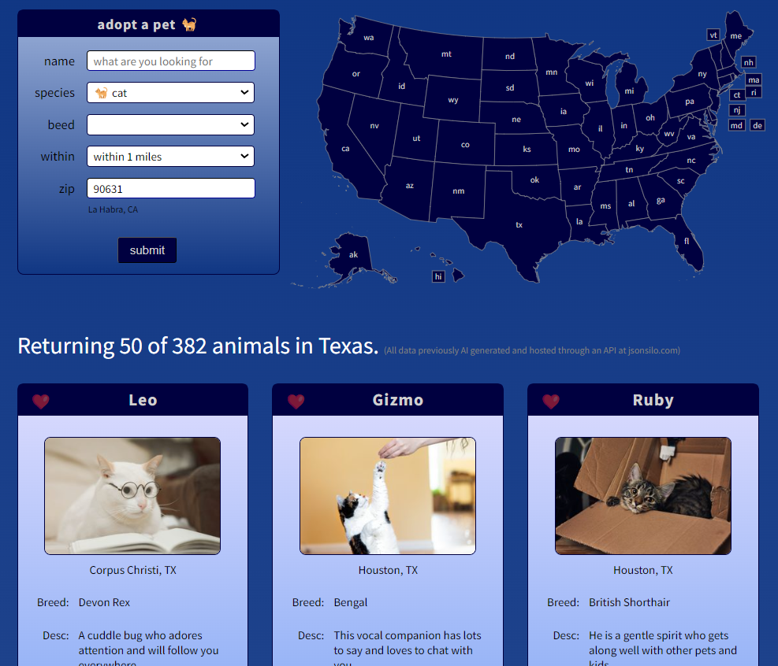

# sba308a

https://github.com/timotholt/sba308a

A working mockup of a pet adoption website.

Uses all these external APIs:

Geolocation services:

    ip-api.com -- Used to populate form box with the current zip code (GET)
        GET: http://ip-api.com/json/                     

Zipcode math:

    zip-api.eu -- Get zipcodes within radius (unlimited free use, only works up to 147 miles)
        GET: https://zip-api.eu/api/v1/radius/

    zipcodebase.com -- Get zipcodes within radius (very limited use, up to 500 mile radius, use sparingly)
        GET: https://app.zipcodebase.com/api/v1/radius

Json Bulk Storage:

    jsonsilo.com -- Used ONLY for the huge bulk searches processed internally by the app (unlimited API usage)
        GET:
            https://api.jsonsilo.com/public/b07d2a0d-022e-41e3-a3f6-2b4249e88f0a/

| Requirement | Weight | Completed |
| :--- | :---: | :---: |
| Use the fetch API or Axios to communicate with an external web API. Use the data provided by this API to populate your application’s content and features. | 20% | ✅ |
| Create user interaction with the API through a search feature, paginated gallery, or similar. This feature should use GET requests to retrieve associated data. | 15% |  |
Enable user manipulation of data within the API through the use of POST, PUT, or PATCH requests. Ensure your chosen API supports this feature before beginning. | 15% |  |
Make use of Promises and async/await syntax as appropriate. | 15% | ✅ |
Organize your JavaScript code into at least three (3) different module files, and import functions and data across files as necessary. | 3% | ✅ |
Ensure the program runs as expected, without any undesired behavior caused by misunderstanding of the JavaScript event loop (such as race conditions, API calls being handled out of order, etc.). | 5% | ✅ |
Create an engaging user experience through the use of HTML and CSS. | 5% | ✅ |
Ensure that the program runs without errors (comment out things that do not work, and explain your blockers - you can still receive partial credit). | 10% | ✅ |
Commit frequently to the git repository. | 5% | ✅ |
Include a README file that contains a description of your application. | 2% | ✅ |
Level of effort displayed in creativity, presentation, and user experience. | 5% | ✅ |

---

This project includes a bunch of files:

| *Filename* | *Purpose* |
| :--- | :--- |
| index.html | main structure of the application |
| script.js | the usual suspect for storing the bulk of the working code | 
| style.css | the usual style sheet suspect |
| ip/getip.js | interface to ip-api for getting geolocation data |
| user/jsonsilo.js | interface to jsonsilo for bulk user storage (unlimted use) |
| user/nocodeapi.js | interface to read/writing to google sheets (300 api calls per day) |
| usmap/usmap.js | SVG map of the US |
| zipcode/extapi-zipapi.js | interface to zip-api.eu for distance calculations |
| zipcode/extapi-zipcodebase.js | interface to zipcodebase.com for distance calcuations |
| zipcode/zipcode-convert.js | zipcode library |
| zipcode/zipcode.js | zipcode library |
| axios.js | TBD |
| petcard.js | module for making the petcards at the bottom of the screen |
| statusmessage.js | for outputting status messages to the search box |
| ui.js | the main UI processing for the app |
| Includes | |
| axios.min.js | Local copy of the Axios library |
